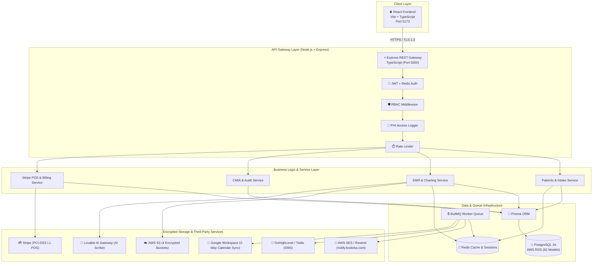

# System Architecture Document

## Radiantilyk Aesthetic — Technical Architecture & Infrastructure Blueprint

**Version**: 3.0 (Fresh Backend Architecture — Zero Vendor Lock-In)  
**Last Updated**: July 24, 2026  
**Practice**: Radiantilyk Aesthetic (San Jose, CA)  
**Privacy & Security Officer**: Kiem Vukadinovic, NP & Founder  
**Medical Director**: Dr. Aloysius N. Fobi, MD  
**Target Compliance Standard**: Designed for HIPAA-aligned & California CMIA-aligned implementation  
**Reference**: [PRD.md](./PRD.md) | [FLOW.md](./FLOW.md) | [DB-SCHEMA.md](./DB-SCHEMA.md)

---

## 1. Overall System Architecture



---

## 2. Layered Control Flow Pattern

The backend enforces a strict layered architecture:

```
Client Request (HTTPS)
       │
       ▼
┌─────────────────────────────────────────────────────────────┐
│  Express Controller Layer (src/modules/*/*.controller.ts)   │
│  - Parses HTTP request parameters/headers                   │
│  - Executes Zod validation middleware                       │
│  - Delegates to Service Layer (NO DB ACCESS IN CONTROLLERS)  │
│  - Formats standardized JSON response                       │
└──────────────────────────────┬──────────────────────────────┘
                               │
                               ▼
┌─────────────────────────────────────────────────────────────┐
│  Service Layer (src/modules/*/*.service.ts)                 │
│  - Contains ALL business logic                              │
│  - Orchestrates Prisma ORM calls & external APIs            │
│  - Dispatches background jobs to BullMQ                     │
│  - Throws custom typed errors (AppError, NotFoundError)     │
└──────────────────────────────┬──────────────────────────────┘
                               │
                               ▼
┌─────────────────────────────────────────────────────────────┐
│  Prisma ORM & PostgreSQL Layer                              │
│  - Type-safe database queries (prisma.model.findUnique)     │
│  - Parameterized queries (SQL injection prevention)          │
│  - Managed migrations via Prisma Migrate                    │
└─────────────────────────────────────────────────────────────┘
```

---

## 3. Vendor Data & BAA Mapping Table

Per HIPAA §164.308(b) and California CMIA, every vendor storing, processing, or transmitting Radiantilyk business or client data is cataloged below:

| Vendor | System Role | Data Held | BAA / Compliance Target | Routing & Policy |
|--------|-------------|-----------|------------------------|------------------|
| **AWS RDS PostgreSQL** | App Database | All Application Data & PHI | BAA Required | Encrypted at rest (AES-256) |
| **AWS S3** | Encrypted Object Storage | Documents, Photos, Consents, Audio | BAA Required | Presigned URLs (No public URLs) |
| **AWS SES / Resend** | Transactional Email (`notify.bookrka.com`) | Name, Appt Time, Service, Receipts, OTP | BAA Required | Transactional client emails + VO Alerts |
| **GoHighLevel / Twilio** | Two-Way SMS & Reminders | Name, Phone, Appt Time | BAA Required | Minimal PHI in message bodies |
| **Stripe** | Credit Card & Terminal POS | Card Tokens, PII, Amounts | PCI-DSS Level 1 | PCI compliant (No PHI in metadata) |
| **Google Workspace** | 2-Way Staff Calendar Sync | Staff Email, Appt Metadata | BAA Click-Accept | Minimal titles (No diagnosis) |
| **Affirm** | Patient Checkout Financing | Customer PII, Amount | Financial Agreement | Optional financing link |
| **Redis / BullMQ** | Sessions, Caching, Queue | Session Tokens, Job Data | Self-Hosted / Encrypted | Ephemeral data, encrypted |
| **Brevo** | Marketing Email Campaigns | Subscriber Email, Opt-in | ❌ NO BAA (Marketing ONLY) | **STRICTLY NO PHI** |

---

## 4. Backend Directory Structure (`backend/`)

```
backend/
├── src/
│   ├── config/
│   │   ├── database.ts              # Prisma client initialization
│   │   ├── redis.ts                 # Redis & ioredis client
│   │   ├── s3.ts                    # AWS S3 client & presigned URL generator
│   │   ├── stripe.ts               # Stripe API client
│   │   ├── email.ts                # AWS SES / Resend config
│   │   ├── sms.ts                  # Twilio config
│   │   ├── logger.ts              # Winston/Pino structured logger
│   │   └── env.ts                  # Zod environment variable validation
│   │
│   ├── middleware/
│   │   ├── auth.middleware.ts       # JWT verification & Redis session check
│   │   ├── rbac.middleware.ts       # Role-based access control
│   │   ├── audit.middleware.ts      # PHI access logging (AuditLog & PhiAccessLog)
│   │   ├── validate.middleware.ts   # Zod request schema validation
│   │   ├── rateLimiter.middleware.ts # express-rate-limit middleware
│   │   └── errorHandler.middleware.ts # Global error handling middleware
│   │
│   ├── modules/
│   │   ├── auth/                    # Auth controller, service, routes, schemas
│   │   ├── users/                   # Users, roles, permissions
│   │   ├── patients/                # Patient profiles, demographics, histories, allergies, meds, documents, photos, deletion requests
│   │   ├── appointments/            # Appointments, availability, time-off, waitlist, status histories
│   │   ├── clinical/                # SOAP notes, note versions, cosign queue, addendums, GFE, protocols, adverse events, AI scribe
│   │   ├── consents/                # Consent templates, versions, assignments, signatures, audit history
│   │   ├── intake/                  # Intake form responses & tokens
│   │   ├── staff/                   # Staff profiles, locations, 2-way Google calendar sync
│   │   ├── services/                # Service catalog, categories, pricing
│   │   ├── locations/               # Clinic locations
│   │   ├── inventory/               # Inventory lots, products, movements, lot expiry tracking, treatment usage
│   │   ├── payments/                # Invoices, items, payments, refunds, vouchers, packages, patient credits, no-show charges, webhooks
│   │   ├── compliance/              # HIPAA policies, breach reports, staff training records, device inventories, external disclosures
│   │   ├── audit/                   # System audit logs & PHI access logs
│   │   ├── vendors/                 # Vendors & vendor BAA tracking
│   │   ├── notifications/           # Notification queue & email/SMS logs
│   │   ├── files/                   # S3 presigned upload/download URL handlers
│   │   └── admin/                   # Financial reports, productivity, terminal settings
│   │
│   ├── services/                    # Shared storage, email, sms, pdf wrappers
│   ├── jobs/                        # BullMQ queue & 13 background worker processors
│   ├── utils/                       # ApiResponse, ApiError, JWT helpers, sanitizers
│   ├── types/                       # TypeScript ambient definitions
│   └── server.ts                    # Express entry point
│
├── prisma/
│   └── schema.prisma                # Sole database schema source of truth (62 models)
├── .env
├── package.json
└── tsconfig.json
```

---

## 5. Security & Risk Analysis

### 5.1 Architecture & Database Risks & Mitigations

| Risk Area | Potential Vulnerability | System Mitigation |
|-----------|-------------------------|-------------------|
| **PHI Exposure in Logs** | Developer logs ePHI in application output | Winston logger configured with a sanitizer mask filtering out PHI fields |
| **SQL Injection** | Unsanitized database input | Prisma ORM uses parameterized queries exclusively; raw SQL forbidden |
| **Data Orphaning** | Deleting a patient or note leaves orphaned records | `ON DELETE RESTRICT` enforced on all core PHI foreign keys |
| **Unsigned S3 URLs** | Public access to patient photos/documents | All S3 buckets configured with `BlockPublicAccess: true`; presigned URLs expire in 15 mins |
| **Orphaned Audio Files** | AI Scribe audio recordings persist indefinitely | BullMQ `scribeAudioPurgeJob` purges raw S3 audio files after 30 days |
| **Bypassing Cosign** | RN Injectors finalizing chart notes directly | Note status transition enforced at service layer: RN notes MUST go to `pending_cosign` |
| **Stripe Metadata Leak** | Leaking diagnosis or procedure data to Stripe | Stripe payload limited to SKU IDs and amounts; no clinical notes in Stripe metadata |

---

*This ARCHITECTURE v3.0 document defines the complete technical architecture for Radiantilyk Aesthetic.*
