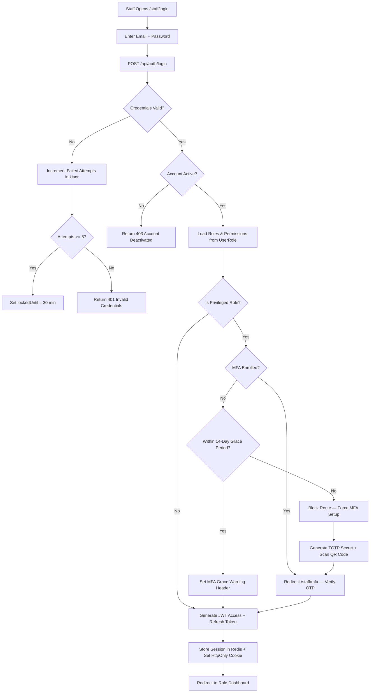
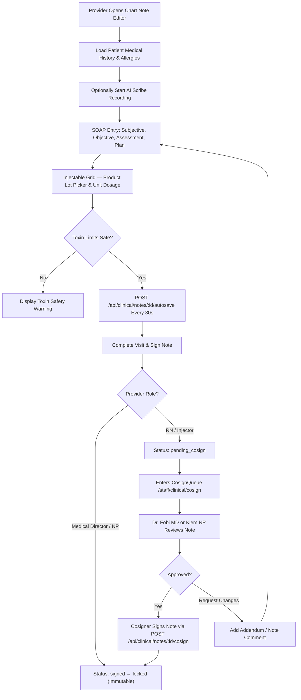
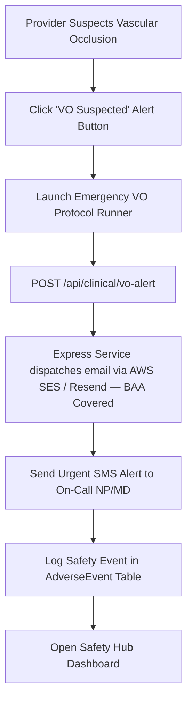
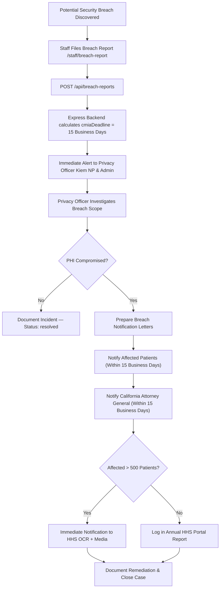
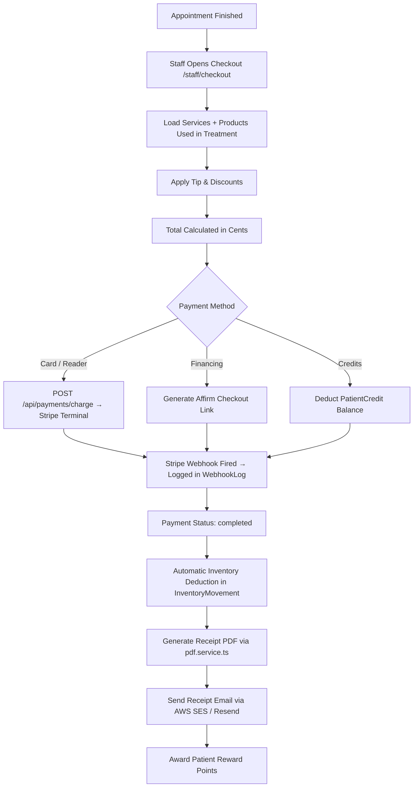

# Application Workflow Documentation

## Radiantilyk Aesthetic — Complete User, Clinical & Compliance Flows

**Version**: 3.0 (Fresh Architecture — Node.js, Express, Prisma ORM, AWS S3, Redis)  
**Last Updated**: July 24, 2026  
**Reference**: [PRD.md](./PRD.md) | [DB-SCHEMA.md](./DB-SCHEMA.md) | [ARCHITECTURE.md](./ARCHITECTURE.md)  
**Standard**: Designed for HIPAA-aligned & California CMIA-aligned implementation  

---

## 1. Staff Authentication & Access Flow

### 1.1 Staff Login & MFA Grace-Period Flow



### 1.2 Session Management & Idle Auto-Logout

```
Login → JWT Access Token (15 min) + Refresh Token (7 days stored in Redis)
         ↓
    Every API Request → Auth Middleware checks JWT
         ↓
    Token Expired? → Client calls POST /api/auth/refresh
         ↓
    useIdleLogout Hook (Mounted in StaffLayout shell)
         ↓
    Inactivity >= 15 Minutes → Render 60-Second Warning Modal
         ↓
    No User Interaction → Call POST /api/auth/logout → Clear Tokens & Redis Session
```

---

## 2. Patient Journey Flow (Complete)

```mermaid
flowchart TD
    A[🌐 Website Visitor bookrka.com] --> B[Browse Services /services]
    B --> C[Take Skin Quiz /quiz]
    C --> D[Select Treatment]
    D --> E[Book Appointment /book]

    E --> F["Step 1: Service Selection"]
    F --> G["Step 2: Location & Staff"]
    G --> H["Step 3: Date & Time"]
    H --> I["Step 4: Patient Details"]
    I --> J["Step 5: Consents & Deposit Payment"]

    J --> K{New Patient?}
    K -->|Yes| L[Create PatientProfile + Demographics + Marketing Opt-In Timestamp]
    K -->|No| M[Link to Existing PatientProfile]
    L --> N[Enqueue Intake Form Email/SMS Job in BullMQ]
    M --> N

    N --> O[Create Appointment (status: pending)]
    O --> P[Staff Review in Inbox /staff/inbox]
    P --> Q{Approve?}
    Q -->|No| R[Cancel Appointment — Patient Notified]
    Q -->|Yes| S[Update Status: confirmed]

    S --> T[Trigger 2-Way Staff Google Calendar Sync Job]
    T --> U[Enqueue Reminders in BullMQ — 48h / 24h / 1h SMS]
    U --> V[Patient Arrives — Front Desk Check-in (status: checked_in)]
    V --> W[Verify Notice of Privacy Practices Acknowledged]
    W --> X[Verify Consents Signed]

    X --> Y[Provider Starts Visit (status: in_progress)]
    Y --> Z[SOAP Chart Note + AI Scribe Voice Dictation]
    Z --> AA[Treatment Performed + Injectable Lot Burned]
    AB --> AC[Before/After Photos Uploaded via S3 Presigned URL]

    AC --> AD[Checkout /staff/checkout]
    AD --> AE[Stripe Terminal Card Charge / Affirm]
    AE --> AF[Receipt Sent via AWS SES / Resend Email]
    AF --> AG[Update Status: completed]

    AG --> AH[Schedule Post-Op Check-In Job in BullMQ]
    AH --> AI[Patient Reviews Chart Record in Portal /account]
```

---

## 3. Clinical SOAP Charting & Cosign Flow



### AI Scribe Audio Purge Lifecycle Pipeline
```
Visit Recording → POST /api/clinical/scribe/session (Save S3 audio key in ScribeSession)
         ↓
AI Gateway Transcribes Audio → Auto-Generate SOAP Draft
         ↓
BullMQ Cron Job (`scribeAudioPurgeJob`) runs daily
         ↓
Find sessions created > 30 days ago → PURGE raw audio file from AWS S3 bucket
         ↓
Update `ScribeSession.audioPurgedAt` timestamp → Retain transcript & final SoapNote in DB
```

---

## 4. Vascular Occlusion (VO) Emergency Alert Flow



> ⚠️ **CRITICAL RULE**: Emergency alerts MUST route through BAA-covered email services (Resend / AWS SES). **STRICTLY DO NOT ROUTE PHI THROUGH BREVO** (Brevo is for non-PHI marketing only).

---

## 5. California CMIA Breach Notification Flow



---

## 6. Patient Rights & Disclosure Workflows

### 6.1 Patient Record Amendment Flow (`NoteAddendum`)
```
Patient Submits Amendment Request via Portal (/account)
         ↓
POST /api/patients/:id/amendments → Record created in NoteAddendum
         ↓
Notification to Privacy Officer & Note Author
         ↓
Provider Reviews Request (Within 30 Days)
         ↓
If Accepted: Append Addendum to SoapNote (Original note stays immutable)
         ↓
Patient Notified with Updated Chart Copy
```

### 6.2 External PHI Disclosures Flow (`ExternalDisclosure`)
```
Staff Discloses PHI Externally (Referral, Subpoena, Insurance Audit)
         ↓
POST /api/disclosures → Record logged in ExternalDisclosure
         ↓
Capture: Patient, Recipient, Purpose, Description of PHI, Staff ID
         ↓
Record Retained for 6 Years (HIPAA §164.528 / CMIA)
         ↓
Available for Patient Accounting of Disclosures Export
```

### 6.3 PHI Deletion Request Flow (`PhiDeletionRequest`)
```
Patient Requests Data Deletion
         ↓
POST /api/patients/:id/deletion-request → Record logged in PhiDeletionRequest
         ↓
Privacy Officer Performs Retention Check (CA §1300.68)
    ├── Clinical / Medical Records < 7 years → DELETION REJECTED (Legal Retention Obligation)
    └── Non-Clinical Marketing / Intake Drafts → DELETED safely
         ↓
Log Audit Event: PHI_DELETION_PROCESSED in AuditLog
```

---

## 7. Inventory Burn & Checkout POS Flow



---

*This FLOW v3.0 document represents the complete, verified workflow architecture for Radiantilyk Aesthetic.*
